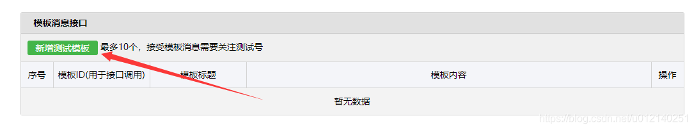
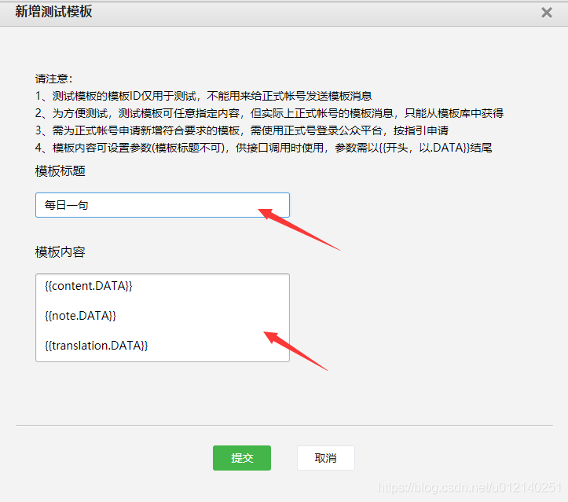

# WechatWeathersend
 参考 https://github.com/LeoNumber1/WechatTemplate 所写
# 使用方法
1. 申请测试号 https://mp.weixin.qq.com/debug/cgi-bin/sandbox?t=sandbox/login
2. 

3. 标题随便写 内容填
```
{{city.DATA}} 
{{day.DATA}} 
{{wea.DATA}} 
{{tem1.DATA}} 
{{air_tips.DATA}}
```


4. 复制模板id到配置文件
5. 复制测试号信息中内容到cfg.ini中对应位置
